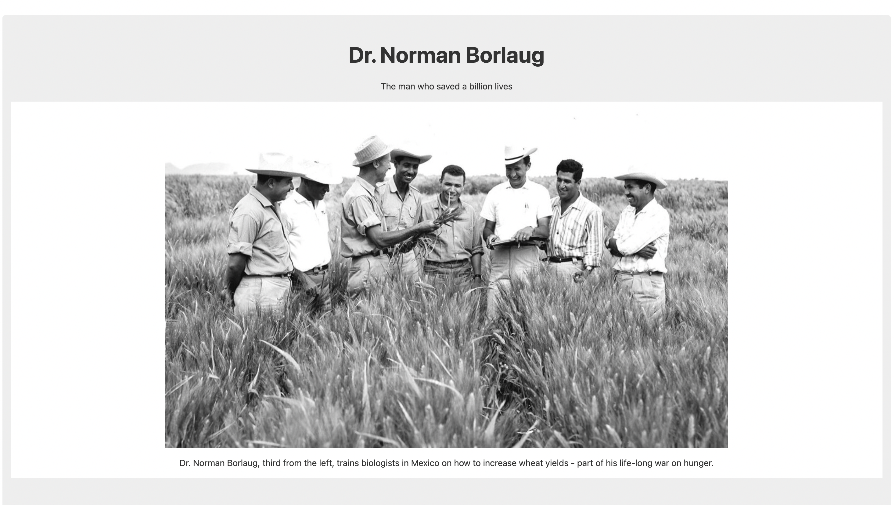
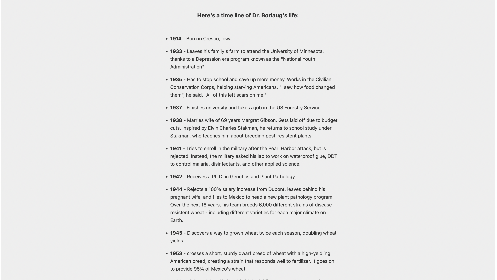
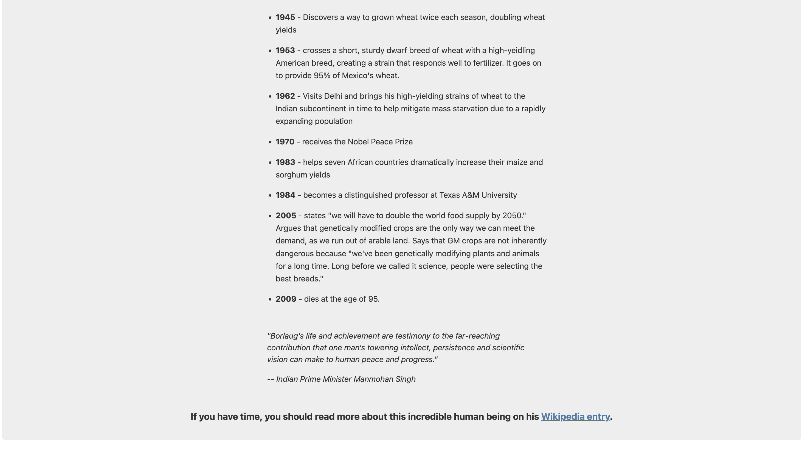

# Tribute Page

### Section 1

### Section 2

### Section 3

After we are done with the project, it should look something like this.

Keep everything you write inside the main tags

The CSS(code that makes it look good) is applied using the following / id/ tags. When using the elements: html, body, h1, h2, a, img, ul, li, blockquote, there is css prewritten for it.

The  main photo can be used with the following URL [https://cdn.freecodecamp.org/testable-projects-fcc/images/tribute-page-main-image.jpg](https://cdn.freecodecamp.org/testable-projects-fcc/images/tribute-page-main-image.jpg)

BUILD one section at a time.

------
# Notes
For the container div, use `img-div ` as the ID for the element

When writing caption for the image, use  `img-caption` as ID

When writing the headline that starts the timeline, use `headline `as ID

Happy coding, and remember: Debugging is like being the detective in a crime movie where you are also the murderer. 😜

### 0. Clone the public repository

> [!WARNING]  
> Edit according to new project structure

### 1. Create the page on your personal main branch
For the sake of practicing git branch and merge, you will develop each section in a seperate branch. In the end you will merge them into your personal main branch.

**1. Commit and push sections**

To do for each section:

`git checkout main`
`git checkout -b <your-name>-section<x>`
*develop your section*
`git add <your-file>`
`git commit -m "create section x"`
`git push --set-upstream origin <your-name>-section<x>`

**2. Merge your sections into your personal branch**

`git checkout main`
`git checkout -b <your-name>-main`
`git merge <your-name>-section1`
`git merge <your-name>-section2`
`git merge <your-name>-section3`

> **ⓘ Merge resolution in case of conflict:**
> 
> *Combine changes by opening the file in your editor*
> *Save your resolution*
> `git add <file>`
> `git commit -m "merge section x"`

### 3. Recreate the page using your classmate work

**1. Fetch your classmates' work**

`git fetch`
`git checkout <classmate-branch>`
And choose the branch you want to use

**2. Merge other's work in your collab' branch**

`git checkout main`
`git checkout -b <your-name>-collab`
`git merge <classmate-branch>`
`git push --set-upstream origin <your-name>-collab`